# 🏍️ Full Stack Microservices Deployment – Hero Vired Final Assignment

## 📘️ Objective

Deploy a fully containerized microservices-based e-commerce app on AWS EKS using Kubernetes and Jenkins.

---

## 🛠️ Tech Stack

- **React 18** + Axios (Frontend)
- **Node.js** + Express + MongoDB (Microservices)
- **Docker & DockerHub** (Image Management)
- **Kubernetes (EKS)** for Orchestration
- **Jenkins** for CI/CD Pipeline
- **AWS CLI, kubectl** on Jenkins Agent

---

## 🗓️ Step-by-Step Breakdown

### ✅ **Step 1: Local Setup**

- Cloned and ran the full-stack e-commerce app locally.
- Verified all 4 backend microservices (User, Product, Cart, Order).
- Frontend connected with all services via REST APIs.
  
📸 *Screenshot: Backend API Testing*
<p align="center">
  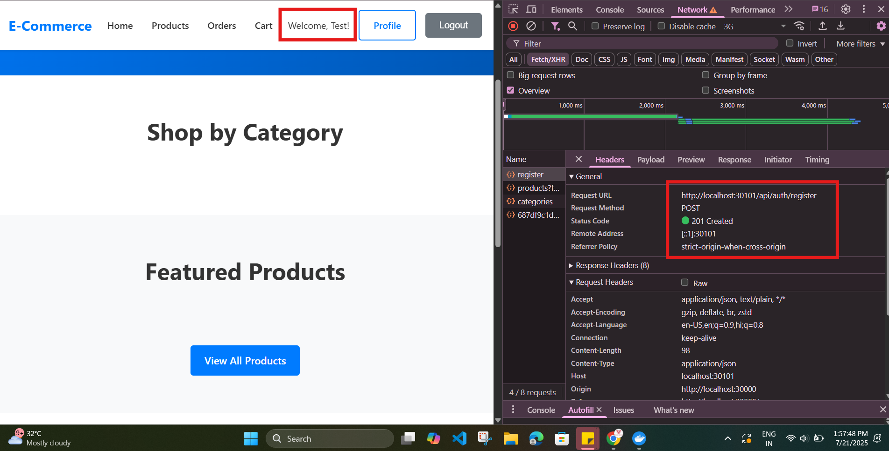
</p>


---

### ✅ **Step 2: Dockerization**

- Created Dockerfiles for each backend service + frontend.
- Built and tested Docker images locally.
- Tagged and pushed images to DockerHub.

📸 *Screenshot: API Testing on Browser*
<p align="center">
  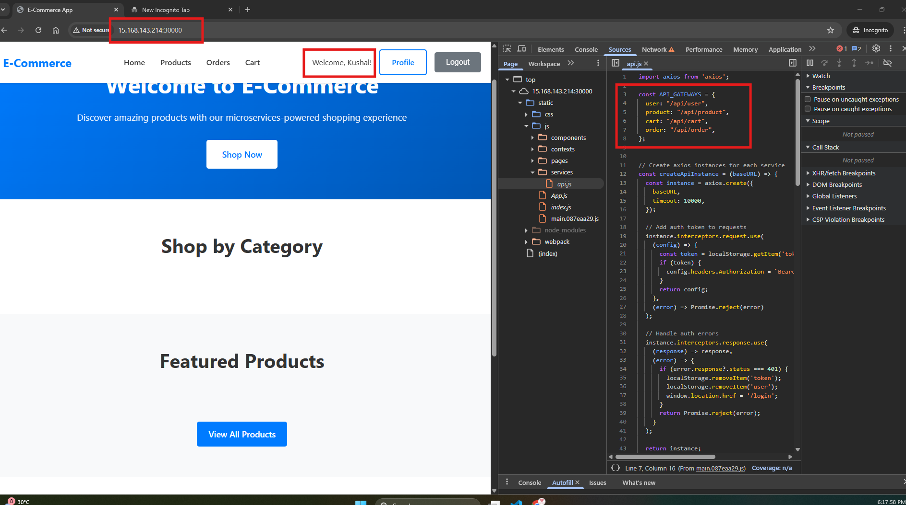
</p>

<br>

📸 *Screenshot: `docker build` sample output screenshots*
<p align="center">
  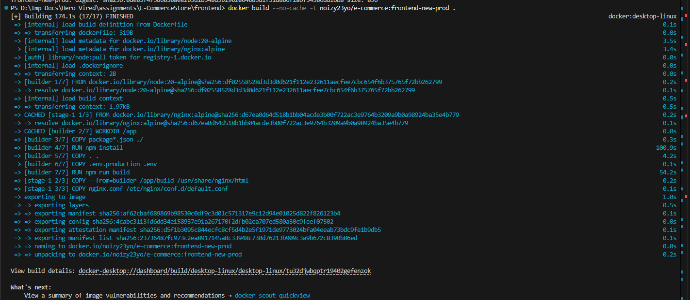
</p>

<br>

📸 *Screenshot: `docker push` sample output screenshots*
<p align="center">
  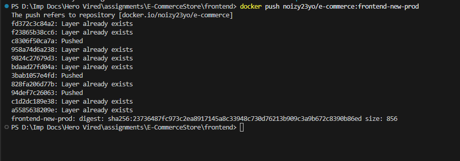
</p>

---

### ✅ **Step 3: Kubernetes on AWS EKS**

- Created EKS cluster: `noizy-ecom-v2` (ap-northeast-3)
- Created Deployments + Services for all services + MongoDB using PVC
- Used internal DNS for service-to-service communication.

```bash
kubectl apply -f mongo.yaml
kubectl apply -f user-service.yaml
kubectl apply -f product-service.yaml
kubectl apply -f cart-service.yaml
kubectl apply -f order-service.yaml
kubectl apply -f frontend.yaml
```

<br>

📸 *Screenshot: EKS Cluster Creation*
<p align="center">
  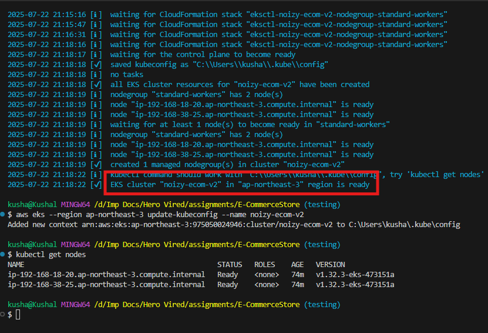
</p>

<br>

📸 *Screenshot: Cluster Confirmation from User*
<p align="center">
  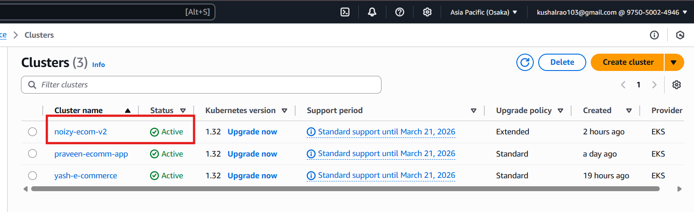
</p>

<br>

📸 *Screenshot: Worker Nodes*
<p align="center">
  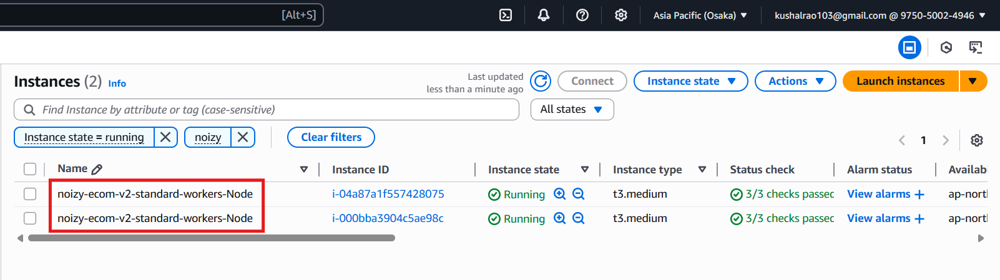
</p>

<br>

📸 *Screenshot: Creation of Deployment Services*
<p align="center">
  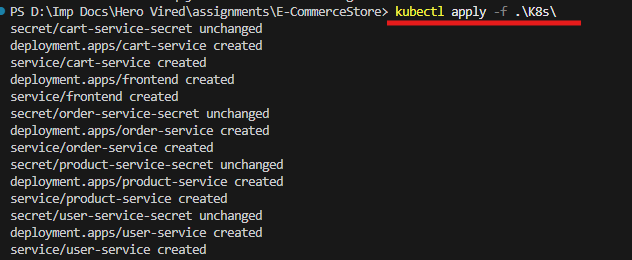
</p>

<br>

📸 *Screenshot: Pods and Services*
<p align="center">
  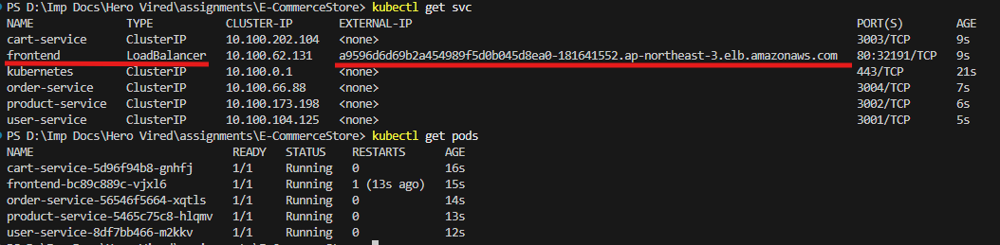
</p>

<br>

📸 *Screenshot: User-Service API health check*
<p align="center">
  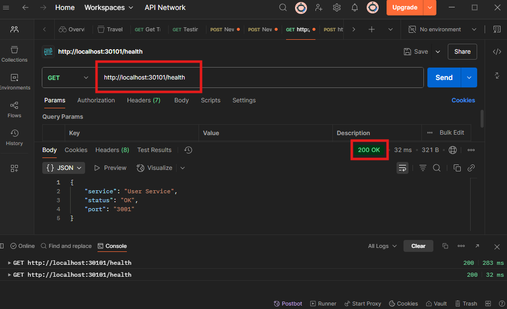
</p>


---

### ✅ **Step 4: Jenkins CI/CD Pipeline**

- Setup Jenkins on EC2 with Docker, AWS CLI, kubectl
- Created Jenkins pipeline for auto-deployment:
  - Checkout code
  - Build + push Docker images
  - Update kubeconfig for EKS
  - Deploy manifests in `k8s/`

📄 `Jenkinsfile` contains full declarative pipeline

<br>

📸 *Screenshot: Jenkins Pipeline*
<p align="center">
  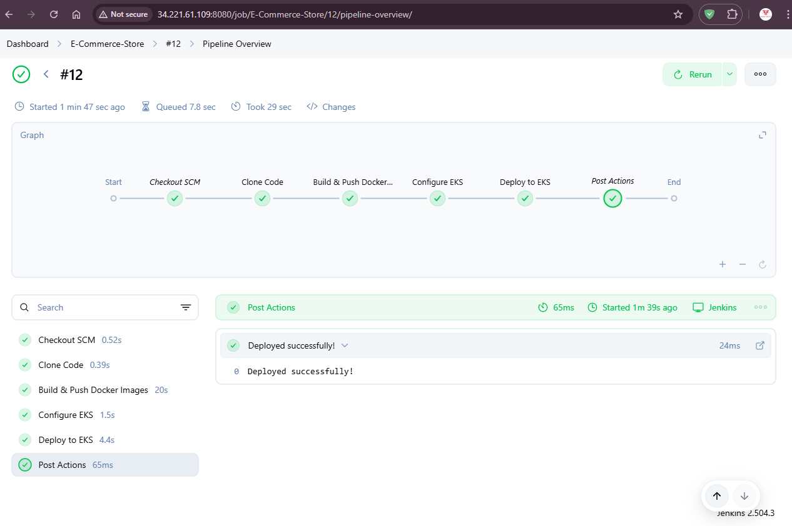
</p>

<br>

📸 *Screenshot: Pipline Console Log*
<p align="center">
  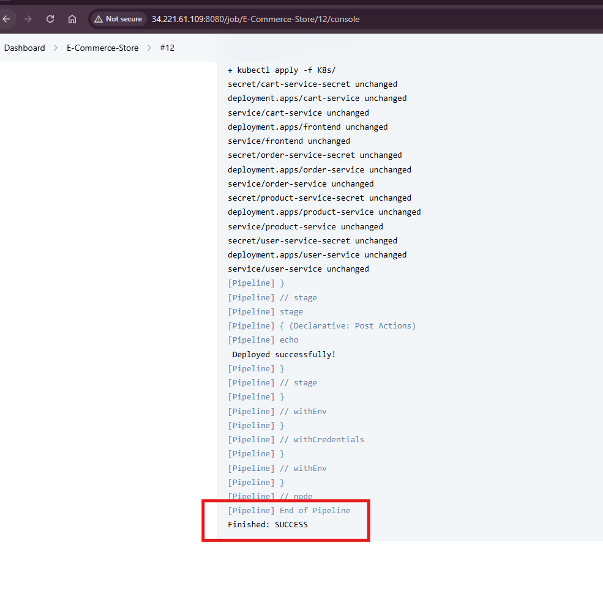
</p>


---

### ♻️ GitHub Webhook Integration

- Configured GitHub webhook to trigger Jenkins on push to `main`
- Used `githubPush()` trigger in Jenkinsfile
- Webhook URL: `http://<jenkins-ip>:8080/github-webhook/`

<br>

📸 *Screenshot: Working API in production*
<p align="center">
  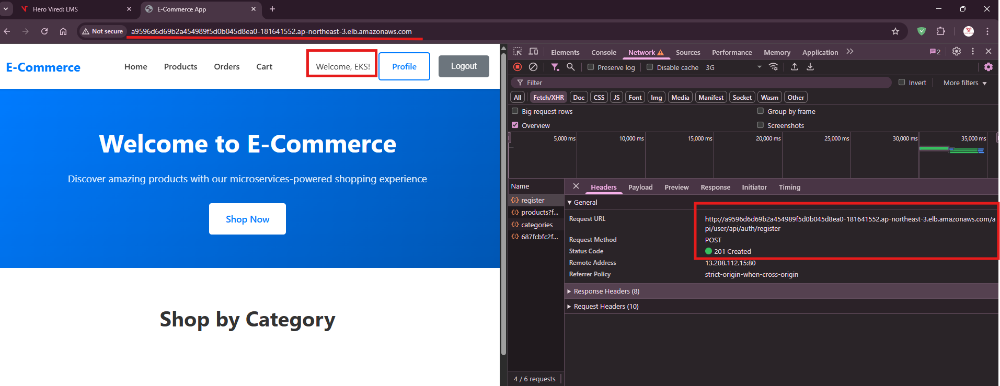
</p>

<br>

📸 *Screenshot: Github webhook log from Jenkins*
<p align="center">
  
</p>


---

## 🔐 Security & DevOps Practices

- Docker images use `alpine` and `node:slim` where possible
- `.env.production` injected securely at build time
- Kubernetes services use ClusterIP for private microservice access
- NodePort (30000) used for frontend access on EKS node

---

## 👨‍💻 Author

- **U KUSHAL RAO**
- GitHub: [@kushal1997](https://github.com/kushal1997)

---

## 🚀 Reproduce Steps

1. Clone the repo: `https://github.com/kushal1997/E-CommerceStore.git`
2. Build Docker images for all services
3. Push to DockerHub
4. Create EKS cluster and run `kubectl apply -f k8s/`
5. Setup Jenkins with Docker, kubectl, AWS CLI
6. Connect webhook from GitHub → Jenkins
7. Push to `main` → Jenkins builds + deploys to EKS
8. Access app via `http://<node-ip>:30000`

---

## 📚 Challenges Faced & How I Overcame Them

### 🔴 1. React Environment Variables Not Updating in Docker Builds

- **Issue:** The frontend kept sending requests to `http://localhost:3001` even after setting the correct `.env.production`.
- **Fix:** Realized that React only reads env vars at build time. Added `.env.production` as `.env` before `npm run build` in Dockerfile and rebuilt with `--no-cache`.

### 🔴 2. Browser Couldn't Reach Internal Service URLs

- **Issue:** Frontend tried to reach `http://user-service:3001`, which failed in browser.
- **Fix:** Used NGINX reverse proxy inside the frontend container and changed frontend API base URLs to `/api/user`, etc.

### 🔴 3. NGINX Proxy Made URLs Like `/api/user/api/auth/register` (404)

- **Issue:** User service expects `/api/auth/register`, not `/api/user/api/...`
- **Fix:** Used `rewrite ^/api/user(/.*)$ $1 break;` in nginx.conf to strip the prefix.

### 🔴 4. Jenkins AWS CLI: "Unable to locate credentials"

- **Fix:** Added AWS credentials using Jenkins Credential Manager and injected them into `environment` block with `withEnv([...])` before running AWS CLI.

### 🔴 5. GitHub Webhook Not Triggering Jenkins

- **Fix:** Installed GitHub plugin, set `githubPush()` in Jenkinsfile, and opened port 8080 for GitHub to access Jenkins webhook URL.

---

## 📄 Extended Docs

For a detailed breakdown of my custom Jenkins EC2 setup (configured from scratch with AWS CLI, Docker, kubectl, and GitHub integration), please refer to:

➡️ [Jenkins EC2 Setup Documentation](Jenkins_Setup_In_EC2.md)
